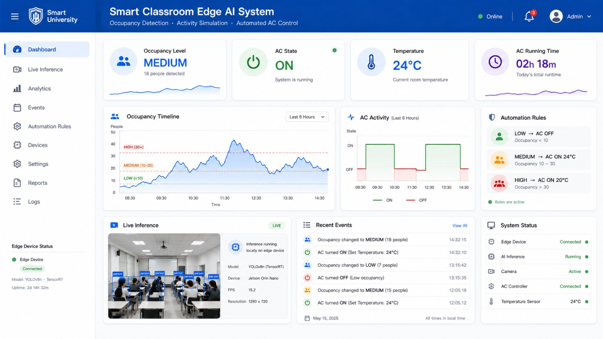

# 🎓 Smart Classroom Edge AI System

An edge-computing application that detects people in classroom video, measures
occupancy, and recommends energy-aware air-conditioner settings in real time.
The system combines a **YOLO11 ONNX model**, a **FastAPI inference service**, and
a responsive **React dashboard** with light and dark modes.

> Developed for the University of Jaffna Edge Computing Project — 2026.

---

## 📖 Project Overview

The Smart Classroom Edge AI System processes camera or uploaded-video frames on
a local edge device. It does not need to send classroom footage to a cloud
service for inference.

The system can:

- detect and count people in classroom video;
- classify occupancy as Empty, Low, Medium, or High;
- recommend AC state and temperature from occupancy;
- protect the simulated AC from rapid state and temperature changes;
- display live status, detections, activity, and running time;
- accept classroom-video uploads for demonstration;
- allow manual AC override and editable occupancy thresholds;
- run locally or as Docker containers.

---

## 🏗️ System Workflow

```text
Camera or uploaded classroom video
                 │
                 ▼
        Local edge device
                 │
                 ▼
      YOLO11 ONNX inference
                 │
                 ▼
    Person detection and counting
                 │
                 ▼
      Occupancy classification
                 │
                 ▼
   Protected AC control recommendation
                 │
                 ▼
       React monitoring dashboard
```

The backend performs inference locally with OpenCV DNN. The frontend polls the
FastAPI service and presents the current classroom state without storing faces.

---

## 🚀 Features

- Local YOLO11 ONNX person detection
- Webcam, video-file, RTSP, and HTTP-stream input support
- Classroom-video upload up to 1 GB
- Empty, Low, Medium, and High occupancy classification
- Configurable Low, Medium, and High people thresholds
- Automatic AC ON/OFF and temperature recommendations
- AC minimum-runtime and cooldown protection
- Manual Auto, OFF, and ON controls
- Live annotated snapshot and inference statistics
- AC runtime and occupancy activity monitoring
- Responsive light and dark dashboard themes
- Docker Compose deployment
- One-click Windows startup script

---

## 📊 Occupancy and AC Rules

The backend uses the following default rules:

| People detected | Occupancy | AC state | Temperature |
| ---: | --- | --- | ---: |
| 0 | Empty | OFF | — |
| 1–2 | Low | OFF | — |
| 3–9 | Medium | ON | 24°C |
| 10+ | High | ON | 20°C |

The dashboard allows the user to adjust the people thresholds manually. Timing
guards prevent noisy detections from rapidly switching the simulated AC.

---

## 🧠 Model Contract

| Property | Value |
| --- | --- |
| Task | Classroom person detection |
| Model | YOLO11n |
| Format | ONNX |
| Input | `1 × 3 × 320 × 320` float32 RGB tensor |
| Preprocessing | Letterbox padding, RGB conversion, normalization to 0–1 |
| Inference engine | OpenCV DNN |
| Default confidence | 0.25 |
| Default IoU threshold | 0.45 |

The exported model is located at
`backend/models/classroom_person.onnx`. A separate Data Scientist handoff copy
and its documentation are available under `data-science/`.

---

## 📁 Project Structure

```text
Edge-Computing-Project-group-6/
├── backend/
│   ├── models/
│   │   └── classroom_person.onnx
│   ├── .env.example
│   ├── Dockerfile
│   ├── main.py
│   └── requirements.txt
├── data-science/
│   ├── models/
│   │   ├── classroom_person.onnx
│   │   └── README.md
│   ├── src/
│   │   ├── __init__.py
│   │   └── main.py
│   ├── Dockerfile
│   ├── README.md
│   └── requirements.txt
├── frontend/
│   ├── src/
│   │   ├── App.jsx
│   │   ├── api.js
│   │   ├── icons.jsx
│   │   ├── main.jsx
│   │   └── styles.css
│   ├── .env.example
│   ├── Dockerfile
│   ├── nginx.conf
│   ├── package.json
│   └── vite.config.js
├── docs/
│   ├── TEAM_PROJECT_OVERVIEW.md
│   └── dashboard-reference.png
├── scripts/
│   ├── run-backend.ps1
│   ├── run-dashboard.ps1
│   └── start-project.bat
├── docker-compose.yml
├── .gitignore
└── README.md
```

---

## 🛠️ Technologies

| Area | Technology |
| --- | --- |
| Frontend | React 19, Vite 8, CSS |
| Backend API | Python, FastAPI, Uvicorn |
| Computer vision | YOLO11 ONNX, OpenCV DNN, NumPy |
| Web server | Nginx for the production frontend container |
| Deployment | Docker and Docker Compose |
| Edge runtime | Windows or Linux computer with camera/video access |

---

## ⚡ Quick Start on Windows

### Option 1: Double-click startup

1. Install Python 3.10 or newer and Node.js 20 or newer.
2. Create the Python environment once:

```powershell
python -m venv .venv
.venv\Scripts\python.exe -m pip install -r backend\requirements.txt
```

3. Double-click `scripts/start-project.bat`.

The script installs missing frontend packages, starts both services, and opens
the dashboard automatically.

### Option 2: Start each service manually

Backend:

```powershell
python -m venv .venv
.venv\Scripts\Activate.ps1
pip install -r backend\requirements.txt
uvicorn main:app --app-dir backend --host 127.0.0.1 --port 8010
```

Frontend, in a second terminal:

```powershell
cd frontend
npm install
npm run dev -- --host 0.0.0.0
```

Open <http://localhost:5173>.

---

## 🐳 Run with Docker Compose

Requirements: Docker Desktop or Docker Engine with Docker Compose.

```bash
git clone https://github.com/Sulodissanayaka/Edge-Computing-Project-group-6.git
cd Edge-Computing-Project-group-6
docker compose up --build
```

Services:

| Service | Address |
| --- | --- |
| Dashboard | <http://localhost:5173> |
| Backend API | <http://localhost:8010> |
| API health check | <http://localhost:8010/health> |

Stop the containers with:

```bash
docker compose down
```

> Camera access from Docker depends on the host operating system. Uploading a
> classroom video from the dashboard is the simplest portable demonstration.

---

## ⚙️ Configuration

Copy the example files before changing local settings:

```powershell
Copy-Item backend\.env.example backend\.env
Copy-Item frontend\.env.example frontend\.env
```

Important backend variables:

| Variable | Default | Purpose |
| --- | --- | --- |
| `CAMERA_SOURCE` | `0` | Camera index, video path, or stream URL |
| `MODEL_PATH` | `models/classroom_person.onnx` | ONNX model location |
| `CONFIDENCE_THRESHOLD` | `0.25` | Minimum detection confidence |
| `IOU_THRESHOLD` | `0.45` | Non-maximum suppression threshold |
| `OCCUPANCY_CONFIRM_SECONDS` | `15` | Confirmation before occupancy increases |
| `OCCUPANCY_RELEASE_SECONDS` | `60` | Confirmation before occupancy decreases |
| `AC_MIN_ON_SECONDS` | `300` | Minimum simulated AC ON duration |
| `AC_MIN_OFF_SECONDS` | `30` | Minimum simulated AC OFF duration |

Important frontend variables:

| Variable | Default | Purpose |
| --- | --- | --- |
| `VITE_USE_API` | `true` | Enables the live FastAPI connection |
| `VITE_API_BASE_URL` | `http://localhost:8010` | Backend address |
| `VITE_API_POLL_MS` | `200` | Dashboard polling interval |

---

## 🔌 Backend API

| Method | Endpoint | Description |
| --- | --- | --- |
| `GET` | `/health` | Model and camera readiness |
| `GET` | `/status` | Count, detections, occupancy, and AC recommendation |
| `GET` | `/snapshot.jpg` | Latest frame with detection boxes |
| `POST` | `/video` | Upload a classroom video for local inference |

---

## 📸 Dashboard

The dashboard displays:

- live inference video and detection boxes;
- people count and confidence;
- occupancy level and recent activity;
- AC state, temperature, and running time;
- inference device, model, latency, and system status;
- editable automation rules and manual AC override;
- dark and light appearance modes.



---

## 🔐 Privacy and Data Safety

- Inference runs locally on the edge device.
- The dashboard does not intentionally store detected faces.
- Uploaded videos, datasets, environments, caches, and credentials are ignored
  by Git.
- Only use classroom recordings with appropriate permission.
- Never commit `.env` files, private datasets, or identifiable recordings.

---

## 🌿 Team Branches

| Branch | Responsibility |
| --- | --- |
| `main` | Reviewed, integrated project |
| `App-Developers` | Dashboard, backend integration, and deployment |
| `Data-Scientists` | Model artifact, inference contract, and AI documentation |
| `Product-Owner` | Product planning and acceptance material |
| `Scrum-Master` | Sprint and process documentation |

Create changes on the appropriate team branch and use a pull request for review
before merging into `main`. Avoid force-pushing shared branches.

---

## 🔮 Future Improvements

- Multi-person tracking with ByteTrack or DeepSORT
- Face and identity anonymization
- Raspberry Pi and NVIDIA Jetson optimization
- MQTT integration with a physical AC controller
- Historical occupancy analytics and export
- Automated model evaluation and retraining
- Authentication and role-based dashboard access
- Hardware temperature and energy-consumption sensors

---

## 👨‍💻 Team

**University of Jaffna**<br>
**Faculty of Science**<br>
**Edge Computing Project — Group 6, 2026**

---

## 📄 License

This project is developed for educational and research purposes. Add a formal
license file before distributing or reusing the project outside the course.

---

## 🙏 Acknowledgements

- University of Jaffna
- Ultralytics YOLO
- OpenCV
- FastAPI
- React and Vite
- Docker
